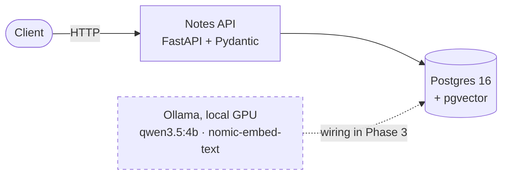

# AI Engineer Track

[](LICENSE)
[](https://www.python.org/)
[](https://github.com/Halomix/ai-engineer-track/commits/master)

A 26-week build log working toward the AI Engineer (LLM/RAG) role. Every phase
ends in something that runs and something that was measured.

Models run **locally on the GPU** via Ollama — no API keys, no per-request cost.
Cloud providers are optional and not needed until Phase 5.

## How it fits together



Solid lines are wired and tested. The dashed line is proven in a standalone
script (`scripts/store_first_vector.py`) — full retrieval joins the API in
Phase 3.

## Getting started from a fresh clone

```bash
# 1. Install dependencies (creates a .venv folder automatically)
uv sync

# 2. Create your settings file
copy .env.example .env

# 3. Download the models (one time, a few GB)
ollama pull qwen3:8b
ollama pull nomic-embed-text

# 4. Start the local database (Docker Desktop must be running)
docker compose up -d

# 5. Confirm everything works
uv run python check_setup.py
```

If step 5 prints `Everything works`, you're set.

## Everyday commands

| Command | What it does |
|---|---|
| `uv run python check_setup.py` | Health check — run this first when anything breaks |
| `ollama list` | Show downloaded models |
| `ollama ps` | Show what's currently loaded in GPU memory |
| `docker compose up -d` | Start the database |
| `docker compose down` | Stop the database |
| `uv run ruff check .` | Find style problems and likely bugs |
| `uv run ruff format .` | Auto-format the code |
| `uv run mypy .` | Check types |
| `uv run pytest` | Run tests |

## Hardware

Built and tested on an RTX 3050 with 6 GB of video memory. Models up to
roughly 8 billion parameters fit; larger ones spill into system memory and
become very slow.

## Progress

| Phase | Weeks | Status | Shipped |
|---|---|---|---|
| 0 — Environment | — | ✅ done | Local models, Postgres+pgvector, health check |
| 1 — Engineering foundations | 1–3 | 🔧 in progress | Notes API validated & tested (wk 1) · real Postgres storage, migrations, a measured 12× index speedup (wk 2) |
| 2 — LLM API fundamentals | 4–6 | ⬜ not started | |
| 3 — Retrieval / RAG | 7–11 | ⬜ not started | |
| 4 — Evaluation | 12–14 | ⬜ not started | |
| 5 — Agents and MCP | 15–19 | ⬜ not started | |
| 6 — Production | 20–23 | ⬜ not started | |
| 7 — Portfolio and applications | 24–26 | ⬜ not started | |

Full per-week detail: [`phase-1/week-1/README.md`](phase-1/week-1/README.md).
